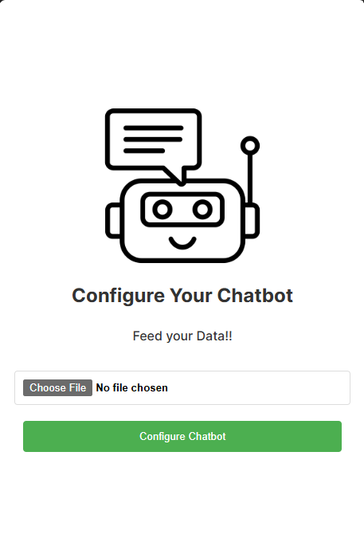
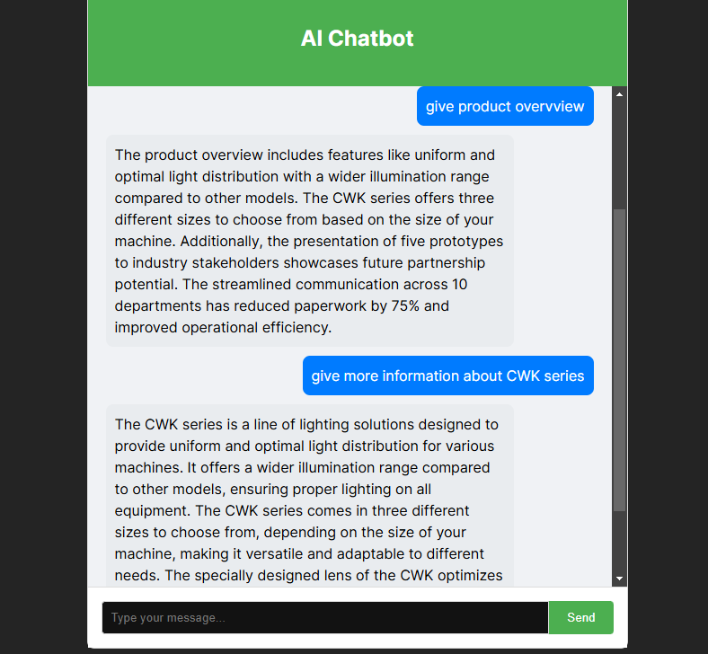

# Chatbot Application Using Retrieval-Augmented Generation (RAG)

This project is a Chatbot application built using Retrieval-Augmented Generation (RAG), leveraging the LangChain framework, Pinecone as a vector database, and OpenAI's large language models (LLMs). The Chatbot efficiently retrieves contextually relevant data from a knowledge base and generates intelligent responses.

## What is LangChain?
LangChain is a framework designed to build applications with the power of LLMs. It simplifies the development of AI-driven applications by connecting LLMs with external data sources (like databases) and integrating tools such as vector stores for retrieval-based approaches.

## What is a Vector Embedding?
Vector embeddings are numerical representations of data, such as text, images, or other media, in a continuous vector space. This representation allows the system to find similar items or contextually relevant data by calculating distances between vectors. Pinecone is used in this project as the vector database to efficiently store and query embeddings.

## Snapshots of the Project
Below are some visual snapshots of the project:

- **User Interface**: 
 

- **Video smaple Bot giving follow-up response.**: 

<video width="640" height="360" controls>
  <source src="sample2.mp4" type="video/mp4" autoplay>
  Your browser does not support the video tag.
</video>

- **Knowledge Base Upload**:  

## Steps to Run the Project Locally
Follow these steps to set up and run the project on your local machine:

### Prerequisites
Ensure you have the following installed on your system:
- Node.js and npm
- Virtualenv (optional but recommended)
- Access to OpenAI API and Pinecone account

### 1. Clone the Repository
```bash
$ git clone https://github.com/theRohan7/Chatbot--RAG-
$ cd chatbot-rag
```

### 2. Set Up the Backend

1. Install required npm dependencies:
   ```bash
   $ npm install
   ```

2. Set up your environment variables:
   Create a `.env` file in the `backend` folder with the following content:
   ```env
   OPENAI_API_KEY=your_openai_api_key
   PINECONE_API_KEY=your_pinecone_api_key
   PINECONE_ENVIRONMENT=your_pinecone_environment
   PINECONE_INDEX=your_pinecone_index_name
   ```

3. Run the backend server:
   ```bash
   $ cd backend
   $ npm run dev
   ```

### 3. Set Up the Frontend
1. Navigate to the frontend directory:
   ```bash
   $ cd ../frontend
   ```

2. Install npm dependencies:
   ```bash
   $ npm install
   ```

3. Start the development server:
   ```bash
   $ npm run dev
   ```

### 4. Access the Application
Open your browser and navigate to `http://localhost:5173`. You can now interact with the chatbot application.

## Features
- **Contextual Chat Responses**: Retrieves relevant information from uploaded documents or a knowledge base.
- **Integration with Pinecone**: For efficient vector embedding storage and retrieval.
- **Customizable Workflows**: Easily extendable for different use cases.
- **Powered by OpenAI LLMs**: Ensures high-quality and coherent responses.


---

For additional queries or support, feel free to reach out!

mail: theorhansahu7@gmail.com

LinkedIn: https://www.linkedin.com/in/rohansahu7/


THANK YOU!